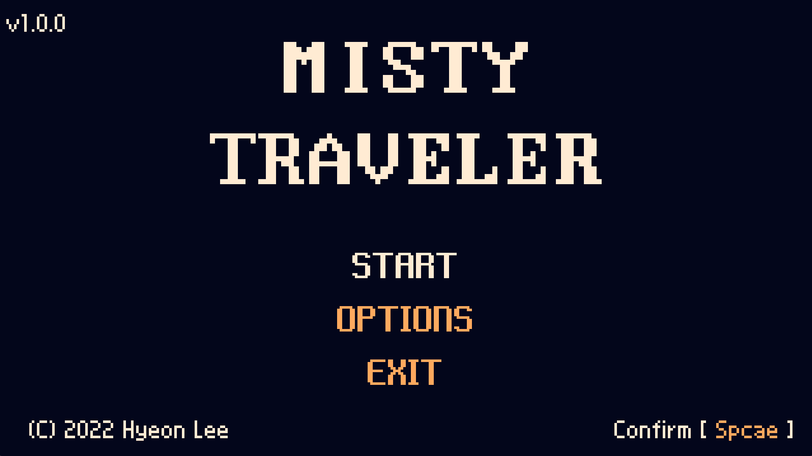
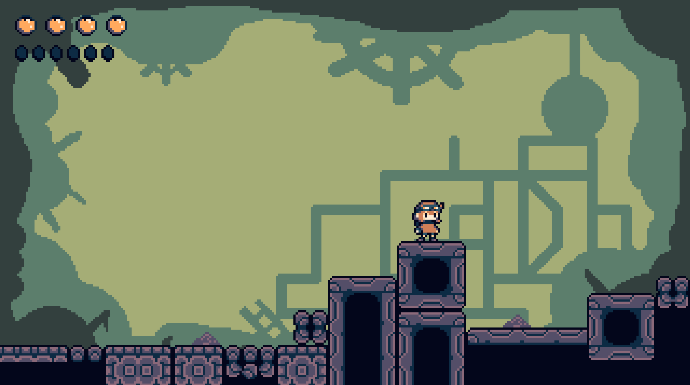
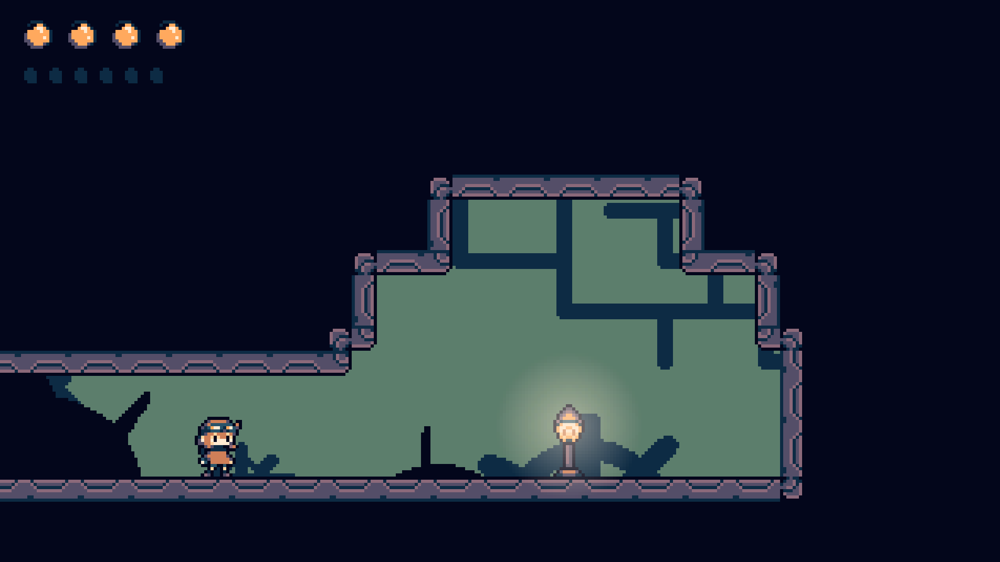
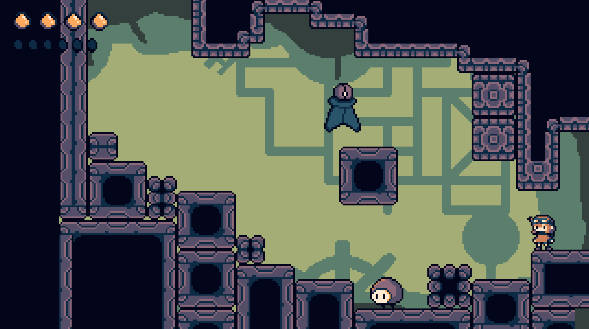

# 미스티 트래블러(MISTY TRAVELER)

미스티 트래블러는 2D 액션 플랫폼 게임으로, 2022년에 대학교 기말 프로젝트로 개발되었습니다.

[다운로드](https://github.com/hyeon-in/Misty-Traveler/releases/download/ver1.0.0/Misty.Traveler.ver1.0.0.zip)

## 게임 플레이 쇼케이스

[플레이 영상](https://youtu.be/-ikpT8n_9M8)

## 개발 세부사항
- **게임 엔진:** 유니티(2021.3.33f1 버전)
- **개발 언어:** C#
- **게임 아트:** Aseprite
- **개발 기간:** 2022년 9월~2022년 12월(4개월)
- **역할:** 1인 개발

## 크레딧

### 음악

"Sneaky Snitch" Kevin MacLeod (incompetech.com)
Licensed under Creative Commons: By Attribution 4.0 License
http://creativecommons.org/licenses/by/4.0/

"Evening Fall (Harp)" Kevin MacLeod (incompetech.com)
Licensed under Creative Commons: By Attribution 4.0 License
http://creativecommons.org/licenses/by/4.0/

Music: Foreign Galaxy by Frank Schroeter
Free download: https://filmmusic.io/song/8414-foreign-galaxy
License (CC BY 4.0): https://filmmusic.io/standard-license
Artist on Facebook: https://www.facebook.com/frank.schroeter.52

### 효과음

효과음들은 [Universal Sound FX](https://imphenzia.com/universal-sound-fx)를 Unity Asset Store에서 구매하여 사용하였습니다. 해당 효과음들의 경우 타인에게 제공하는 것이 금지되어있기 때문에 Asset에 포함하지 않았습니다.

### 폰트
- [갈무리](https://galmuri.quiple.dev/)
- [도스샘물체](https://github.com/hurss/fonts)
- [둥근모 + Fixedsys](https://cactus.tistory.com/193)
- [Neo둥근모](https://neodgm.dalgona.dev/)
- [둥근모 원본](https://ith.kr/about/font.html)

## 라이센스
이 프로젝트는 [MIT 라이선스](LICENSE)에 따라 라이선스가 부여됩니다. 자세한 내용은 [LICENSE](LICENSE) 파일을 참조하세요.

게임에서 사용 된 소스 코드와 스프라이트는 자유롭게 상업적 이용, 수정, 배포가 가능합니다.
